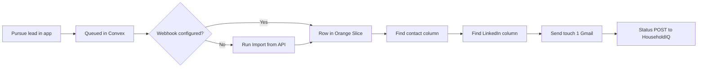

# Orange Slice sheet template (Pursue → import → email)

One-time setup in your Orange Slice spreadsheet, then every **Pursue lead** in HouseholdIQ flows through contact enrichment and Gmail outbound.

**Your sheet:** https://www.orangeslice.ai/spreadsheets/abcba217-93c9-4843-9d66-ee5e7fce40f3/edit

---

## Quick start (5 minutes)

### 1. Convex secret

In [Convex dashboard](https://dashboard.convex.dev) → Settings → Environment Variables, copy `OUTREACH_WEBHOOK_SECRET`.

If unset:

```bash
./scripts/configure-orangeslice-sheet.sh "https://www.orangeslice.ai/spreadsheets/abcba217-93c9-4843-9d66-ee5e7fce40f3/edit"
```

### 2. Paste the chat prompt

Open Orange Slice → chat → paste the full contents of **[ORANGE_SLICE_CHAT_PROMPT.txt](./ORANGE_SLICE_CHAT_PROMPT.txt)**.

Replace `YOUR_OUTREACH_WEBHOOK_SECRET` with your real secret before sending.

This creates columns, configures **Import from API**, contact waterfall, LinkedIn finder, Gmail touch 1/2, and status sync back to HouseholdIQ.

### 3. Optional — auto-push on Pursue (no manual import)

Orange Slice → **Import from webhook** → copy the webhook URL.

```bash
npx convex env set ORANGE_SLICE_SHEET_WEBHOOK_URL "https://...."
```

Rows appear in the sheet immediately when you click Pursue.

---

## End-to-end flow



| Step | Where | What happens |
|------|--------|--------------|
| 1 | HouseholdIQ map | Click **Pursue lead** — owner lookup, campaign copy, queue |
| 2 | Orange Slice | **Import from HouseholdIQ** (or webhook auto-push) |
| 3 | Orange Slice | **Find contact** — email/phone waterfall from owner name + address |
| 4 | Orange Slice | **Find LinkedIn** — profile URL if missing |
| 5 | Orange Slice | **Send touch 1** — Gmail + status webhook |
| 6 | HouseholdIQ | Activity log updates when sheet POSTs status |

---

## Import from API settings

| Field | Value |
|-------|-------|
| **URL** | `https://watchful-condor-23.convex.site/orangeslice/import?limit=25` |
| **Method** | GET |
| **Header** | `Authorization: Bearer <OUTREACH_WEBHOOK_SECRET>` |
| **Rows path** | `data` |

Test:

```bash
curl -s "https://watchful-condor-23.convex.site/orangeslice/import?limit=5" \
  -H "Authorization: Bearer YOUR_SECRET"
```

Each row is flat JSON — column names match 1:1. Example row: [orangeslice-import-example.json](./orangeslice-import-example.json).

---

## Column mapping

| Column | Source |
|--------|--------|
| `household_id` | Assessor block-lot (dedupe key) |
| `owner_first_name`, `owner_last_name` | Used by contact waterfall |
| `city`, `state` | Always `San Francisco`, `CA` — enrichment location |
| `email`, `phone` | From app if known; else filled by **Find contact** |
| `touch1_subject`, `touch1_body` | Pre-written — Gmail sends verbatim |
| `status` | Pipeline state; syncs back via webhook |

Full list: see STEP 1 in [ORANGE_SLICE_CHAT_PROMPT.txt](./ORANGE_SLICE_CHAT_PROMPT.txt).

---

## Status sync (sheet → app)

After Gmail or manual updates, POST:

```
POST https://watchful-condor-23.convex.site/orangeslice/status
Authorization: Bearer <OUTREACH_WEBHOOK_SECRET>
Content-Type: application/json

{ "household_id": "7279-45", "status": "touch1_sent", "event": "gmail_touch1" }
```

---

## Why contact enrichment runs in the sheet (not the app)

- DataSF SODA has **no owner names** online (CA privacy).
- Real names need assessor roll CSV → `./scripts/enrich-owners.sh`.
- Residential email/phone needs a **contact waterfall** (Orange Slice enrichment), which works best with `owner_first_name`, `owner_last_name`, `address`, `city`, `state` — all included in the import payload.

Leads with `recordedOwnerFullName` from assessor roll enrich much better than generic "Property Owner" fallbacks.

---

## Troubleshooting

| Problem | Fix |
|---------|-----|
| Import returns `{ count: 0 }` | Pursue a lead in the app first; only un-imported queued rows are returned |
| Contact waterfall finds nothing | Run `./scripts/enrich-owners.sh` for real owner names |
| Gmail column skips row | Run **Find contact** first; need non-empty `email` |
| App status stuck on "Queued" | Sheet must POST `/orangeslice/status` after send (see STEP 5 in chat prompt) |
